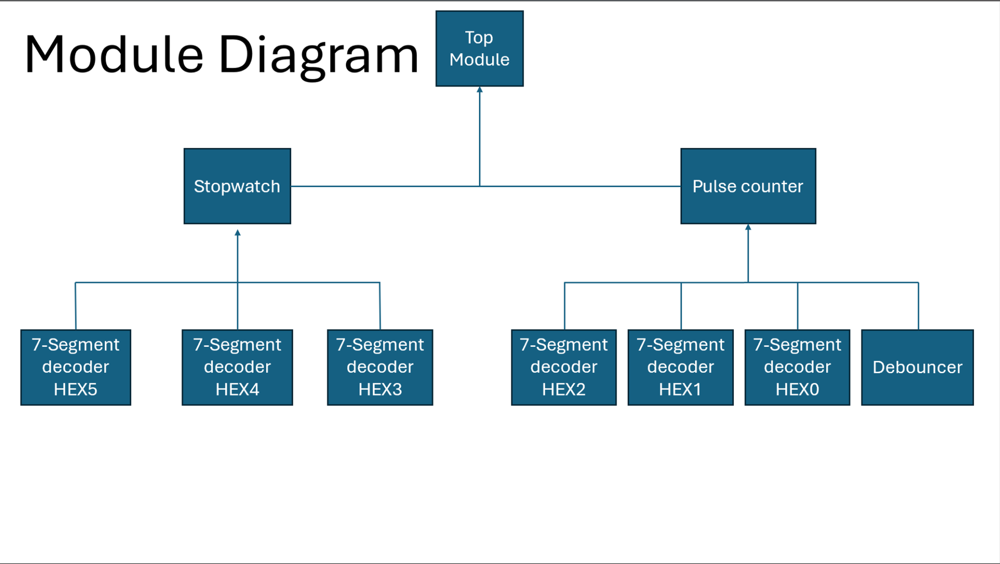
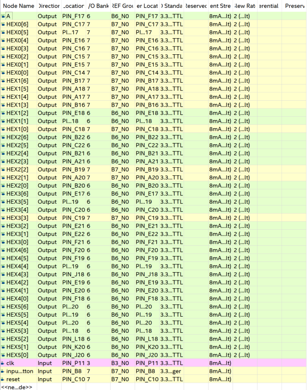

# FPGA-Stopwatch-and-Press-Counter
Modular Verilog-based FPGA game system designed in Quartus for the DE-10 LITE featuring a debounced edge-sensitive press counter, a custom stopwatch module utilizing an internal 50MHz clock, and a custom 7-segment display driver.

## Goal 🎯
I aimed to create a button-mashing game that could be easily implemented on a DE-10 LITE to gain practical experience in combinational and sequential digital circuit design. 

---

## Module Info
Below is the list of Verilog modules in this repository:

- **TopModule.v:** The top-level entity for this project. 
- **pulse_counter.v:** The module responsible for incrementing the score count based on the press-state connected via wire from the debouncer.v module
- **stopwatch.v:** The module responsible for dividing the internal 50MHz clock frequency down to 0.1s. 
- **hex_7seg_decoder.v:** Uses a decoder to determine the output of the 7-segment display
- **debouncer.v:** Debounces the input from the DE-10 LITE's on-board 3.3-V Schmitt Trigger button(KEY[0])

---

## Modular Diagram

---

## Pin Layout
Make sure to check the specific i/o requirements for your board. For the DE-10 LITE, everything but the input button (KEY[0]) use the 3.3 -V LVTTL. The button (KEY[0]) uses the 3.3-V Schmitt Trigger.

---

## How it Works
The modular design calls and controls submodules through the TopModule.v. 
- **TopModule.v** calls the submodules stopwatch.v and pulse_counter.v 
- Two wires are used to control the pulse_counter module. 
    - The wire "storage" connects and transfers the binary value from the output "storage" register in the stopwatch.v module.
    - The wire "active" acts as a Boolean statement comparing the binary value in the "storage" wire to the 10-bit value that is        equivalent to 300 in decimal.
- **pulse_counter.v** calls the debouncer.v module and 3-seperate instances of the hex_7seg_decoder.v module.
    - Inside of an always loop a conditional checks for a debounced button press, the count is less than 999 and the game is active coming from the "active" wire in the TopModule.v
    - If true the count stored in a 10-bit register increments by 1. 
    - Outside of the loop, 3, 4-bit wires "ones, tens, hundreds" use modular division to divide the count register into the correct places.
    - These wires are then sent into the 3-instances of the hex_7seg_decoder.v respectively.
- **stopwatch.v** behaves similiarly to the pulse_counter.v module calling 3-instances of the hex_7segdecoder.v module and using modular division to control the output on each of the 7-segments.
    - Inside of the main always loop a conditional checks that the count is less than 300 and then another nested condtional checks if a secondary counter has incremented to 4,999,999. 
    - The secondary counter is responsible for dividing the 50MHz clock down to 10Hz which is the same as 0.1s. 
    - f=1/T
- **hex_7seg_decoder.v** uses an always block with a case statement to set the binary value of each of the 7-segments
    - parameter "COMMON_ANODE_CATHODE = 0" is a custom parameter set to always be 0
    - The DE-10 has an active-low 7-segment display, however other boards can be active high, so utilizing a conditional assign statement and the custom parameter "COMMON_ANODE_CATHODE =0" always evalues to false flipping the bits from high to low.
- **debouncer.v** takes the input from the button (KEY[0]) and debounces it by requiring it to be stable 10ms. 

---

## Trouble Shooting 🛠

- **Top-Level-Design Entity Error** 
    Make sure to set the TopModule.v to top-level-entity in Quartus by going to Project -> Set as Top-Level Entity.
- **Pins aren't working** 
    Double check all pin assignments and i/0 standards.
    For DE-10 LITE specific pin assignments and i/o standards: [DE-10 LITE USER MANUAL](https://pdfhost.io/v/Q8U7Abt45_DE10-Lite_User_Manual)
- **Timing Errors**
    Confirm 50MHz clock frequency.
- **Programming/USB Blaster Errors**
    Confirm USB Blaster software is installed and updated.
    USB Blaster Windows 11: [Windows 11 USB Blaster](drivers/USB-blaster-windows11.zip)
---